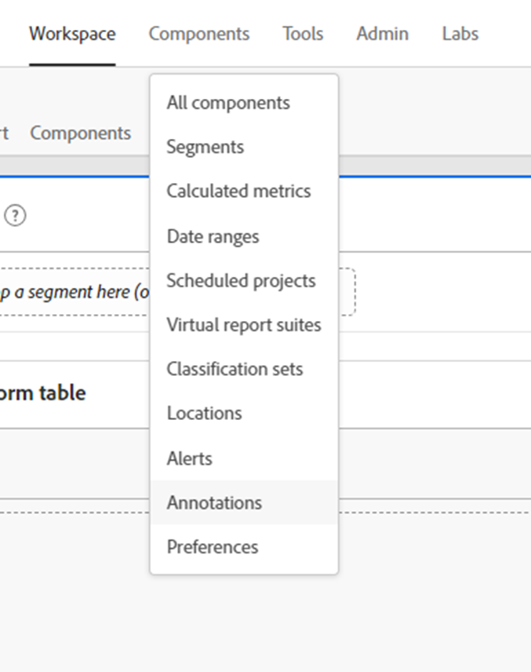

# 释放分析洞察力；利用注释的力量

注释数据组件是AdobeAnalysis Workspace中提供的最简单，但从长期来看，是最省时的功能之一。 与工作区中的任何其他功能不同，它充斥于您和您的工作区用户叙述性历史记忆。

简而言之，注释是可以添加到Adobe工作区内的日期趋势数据的简短描述文本。 注释可为使用Analysis Workspace了解贵公司数据历史的每个人提供上下文，有助于更快速地分析性能并为所有报表提供高度自定义的感觉。

## 用例

在多种情况下，注释都特别有用：

- **离群值（峰值和谷值）**  — 如果您知道趋势数据的主要峰值和谷值的原因，请快速右键单击异常数据点，然后选择“注释选择”以与每个人共享该知识。

- **主要营销活动和测试**  — 作为营销活动和测试（A/B、多变量等） 直接影响流量和性能，每个人都可以轻松获益于在注释中记录这些活动和测试的时间范围。

- **外部因素和事件**  — 无论是重大的一次性事件，还是竞争对手的行为、新产品发布以及相关的全球或国内事件，请务必在Annotations中添加任何与数据相关的外部因素。

- **间隙和错误**  — 您应该使用警报功能来警告您可能会出现数据收集问题，但遗憾的是，即使是最经验丰富的团队也会偶尔遇到某种形式的数据收集错误或暂时性缺口。 注释是一种让用户知道数据缺失或不完整从而最大程度地降低影响的好方法。

## 操作说明

创建和编辑“注释”非常直观，几乎可以一目了然。 右键单击日期趋势可视化图表或自由格式表中的数据点并选择“注释选定内容”以创建注释，或使用主导航到“组件>注释”以创建和编辑注释。

{width="70%"}{width="30%"}

有关批注工作方式的所有详细信息，请务必查看 [有关Experience League的视频教程](https://experienceleague.adobe.com/en/docs/analytics-learn/tutorials/analysis-workspace/navigating-workspace-projects/annotations-in-analysis-workspace).

## 帮助您入门的提示和技巧

最后，提供了一些实用提示以帮助您立即开始使用注释。  使用这些建议有助于使您的注释对所有用户有效、清晰且富有信息。

- **颜色编码**  — “注释”功能允许您从一系列颜色中进行选择，这些颜色显示在工作区项目中，以帮助您区分各种类型的注释。 如果您测量多个不同的网站或应用程序，则可以为每个网站或应用程序选择不同的颜色。 或者可以为每个注释类别使用不同的颜色。

- **标题标签**  — 为用户提供有关注释的简单视觉提示的另一个方法是标记注释的标题。 与颜色编码类似，您可以根据组织构建数据的方式选择不同的标签，例如按渠道或名称（即WEB、APP或ALL）

- **范围**  — 创建注释时，您可以获得所有可用的维度、量度和限制符，以便在适当的上下文中显示注释。 某些注释仅与某些维度或量度相关，因此您可以限制注释向相应的维度或量度显示的时机。

- **另存为**  — 创建一两个注释后，您可以使用省时的“另存为”选项，将它们重新用作模板来创建新注释。

- **注释管理器**  — 使用指向“组件>注释”的主导航来访问注释管理器，您可以在其中找到更多用于创建和编辑注释的功能。

- **权限 —** 如果您无法创建注释，请联系可以在Admin Console中允许“注释创建”的管理员。

有关详细文档，请访问 [批注概述](https://experienceleague.adobe.com/en/docs/analytics/analyze/analysis-workspace/components/annotations/overview) 以及周边的物品。

## 作者

本文作者：

Thomas Edward Buckley，Miles &amp; More（汉莎航空集团）Data Warehouse与Business Intelligence经理

