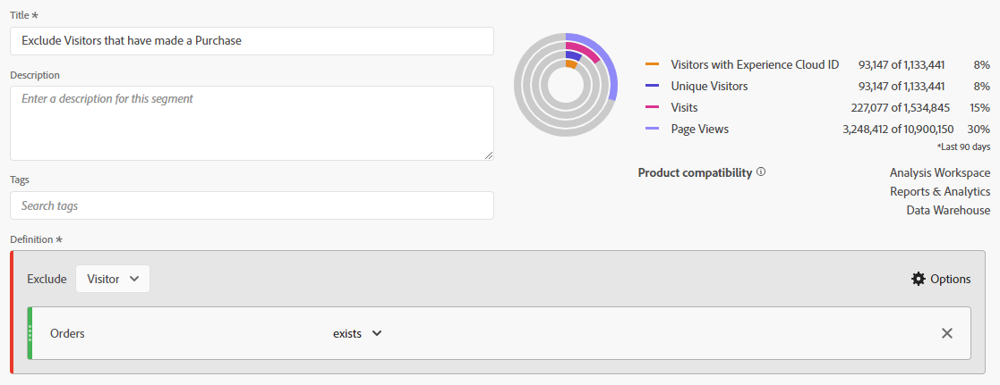
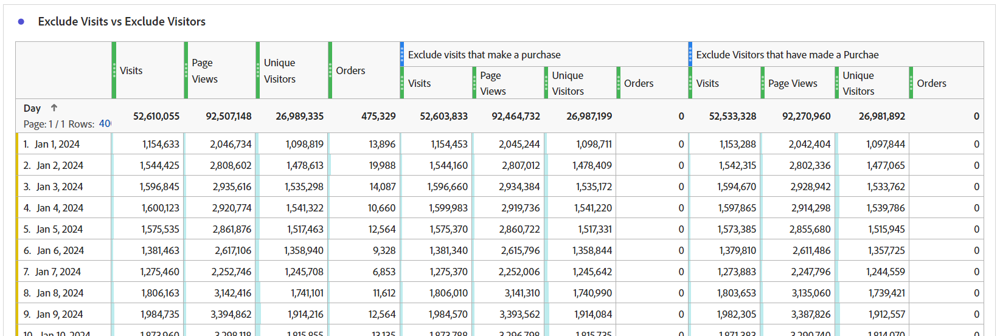
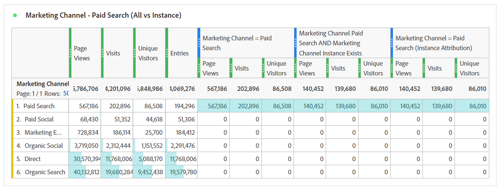
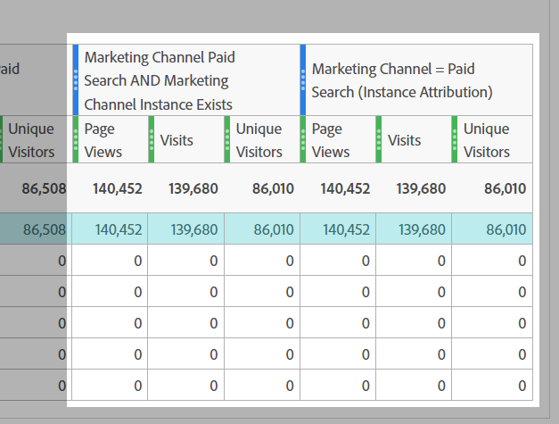

# 幕后的魔法：复杂的区段：排除、容器和归因

_揭示复杂数据分段、探索排除项、容器和归因模型的复杂性。 像魔术师的手法一样，掌握这些技巧使分析师能够执行数据魔术，以精确和巧妙的方式转换见解。_

窗帘是开着的，舞台是放着的……这可能不是拉斯维加斯的魔法表演，但我们在构建区段时可以表演一些非常神奇的技巧。

在本模块中，我们将介绍：

- 排除逻辑
- 使用容器
- 归因模型

## 包含与排除

默认情况下，所有容器均以&#x200B;**include**&#x200B;类型开头，这基本上意味着它们会返回与条件匹配的数据。 但是，您还可以将区段或区段中的容器更改为&#x200B;**排除**&#x200B;类型，从而拒绝某些标准。

虽然魔术师可以在甲板上找到你的卡片，但是魔术师可以让甲板上的其他部分不复存在真是太神奇了。 同样，在排除区段中，我们希望不需要的数据只是从数据集中消失。

你可能会坐在那儿想，“好吧，但我已经有‘不等于’和‘不包含’的选项了，所以这难道不应该涵盖我吗？” 不幸的是，答案是否定的……这不仅仅是能够排除逻辑组，一个元素。 即使处理单个组件，您通常也需要使用&#x200B;*排除*&#x200B;来实现目标。

- **Does not contain / Does not equal** — 就是这样，匹配不包含特定字符串的项目
- **排除：值包含/ equals** — 这将&#x200B;*排除与字符串匹配的*&#x200B;项

乍一看，这两种声音是相同的……并且在&#x200B;**点击**&#x200B;级别区段/容器上，您说得可能没错，因为它们将执行相同的操作。 但是，在使用&#x200B;**访问**&#x200B;或&#x200B;**访客**&#x200B;范围时，您会获得截然不同的结果。

**图1：不包含/不等于 — 点击范围**

*请注意，每次点击都会返回true或false值，并且这些值在“不排除”和“排除”之间反转。*

- “Value”不包含“Example”（是），因此返回true，并且包含该点击；同样，“Example”不包含“Example”（否，它包含该点击），因此返回false，并且不包含该点击。 基本上，返回返回返回真实结果的任何数据。
- “Value”是否包含“Example”（否），因此返回false，且不排除该点击；同样，“Example”是否包含“Example”（是），因此返回true，并排除该点击。 基本上，返回&#x200B;**不是**&#x200B;且结果为true的数据，或返回符合您条件且为false的数据。
- 您可以看到，在&#x200B;**点击**&#x200B;级别，两组逻辑都将返回同一组数据。

**图2：不包含/不等于 — 访问范围**

*如上所述，**访问**&#x200B;内的每次点击都将用相同的true / false进行计算。 但是，返回的数据集是整个访问的数据集。*

- 在每次点击时，“Value”不包含“Example”（是），因此返回true；同样，“Example”不包含“Example”（否，它包含它），因此返回false。
   - 如果访问中的&#x200B;**any**&#x200B;点击返回&#x200B;**true**，则返回&#x200B;**整个访问**。*
   - 如果访问完全由包含“示例”的点击组成，则任何点击都不会返回true，因此该访问将&#x200B;**不在您的数据集中返回**。
- 同样，在每次点击时，“Example”都包含“Example”（是），因此返回true
   - 如果&#x200B;**任何点击**&#x200B;返回&#x200B;**true**，则整个访问将&#x200B;**排除**
   - 如果访问中的&#x200B;**所有点击**&#x200B;返回&#x200B;**false**，则该访问将在您的数据集中返回
- 现在你可以看到这个逻辑在哪里开始分化。 在上面的示例中，有三次不同的访问：
   - 当使用“不包含/等于”时，将返回三个&#x200B;**访问中的两个**。
   - 当使用“Exclude Contains / Equals”时，**只返回这些访问中的一个**

**图3：不包含/不等于 — 访问范围**

*如上所述，**访客**&#x200B;进行的每次点击都将使用相同的true / false逻辑进行计算。 但现在我们查看了此访客在所有访问中所做的所有点击（在选定的日期范围内）。*

- 在每次点击时，“Value”不包含“Example”（是），因此返回true；同样，“Example”不包含“Example”（否，它包含它），因此返回false。
   - 如果访客进行的&#x200B;**any**&#x200B;点击返回&#x200B;**true**，则返回&#x200B;**整个访问**。
   - 如果该访客从未进行任何包含“示例”的点击，则任何点击都不会返回true，因此该访客将&#x200B;**不在您的数据集中返回**。
- 同样，在每次点击时，“Example”都包含“Example”（是），因此返回true。
   - 如果&#x200B;**任何点击**&#x200B;返回&#x200B;**true**，则整个访客（以及随后所有访客）都将&#x200B;**排除。**
   - 如果访问中的&#x200B;**所有点击**&#x200B;返回&#x200B;**false**，则将在您的数据集中返回该访客，从而成功返回未输入“X”的访客。
- 这是访问逻辑的扩展，其中涉及到了更多注意事项。 在上面的示例中，有两个不同的访客，每个访客3次：
   - 当使用“不包含/等于”时，将返回&#x200B;**两个**&#x200B;访客，及其所有&#x200B;**三个**&#x200B;访问（在报表中占2个访客和6个总访问）
   - 使用“Exclude Contains / Equals” **时，仅返回这些访客中的1**，并且只包含与该访客关联的三次访问（在报表中占1个访客和3个总访问次数）

>[!TIP]
>
>此逻辑可能比较复杂，尤其是在开始嵌套容器时……最好对照受控样本数据进行测试，以确保区段实际上返回了您认为它应返回的数据。

### 区段示例1：排除进行购买的访问

在此示例中，我想定位访问网站并在访问期间&#x200B;*未*&#x200B;进行购买的用户（基本上，我想排除执行了交易的访问；因此，我将保留未完成交易的访问）

为了进行比较，让我们查看使用“不存在”构建的区段：

请注意预览如何显示非常不同的结果……事实上，此区段将返回我的全部访问，因为每次访问都至少有一个不包含“订单”量度的点击。

为了进一步说明，让我们并排比较两个区段：

首先，您可以看到尽管区段具有&#x200B;*访问*&#x200B;级别范围，我们仍可以将区段与其他量度（例如页面查看次数或独特访客）配对。 第一组列未分段，以便一目了然地显示一个区段（不存在）返回了近100%的数据，只有排除区段在做我们需要它做的事情。

最引人注目的列是订单，这应该立即清楚地表明“不存在”容器错误，因为大多数订单仍在返回。

### 区段示例2：排除在报告期内购买过的访客

在此示例中，我想使用上一个示例（专门查看访问级别）中的想法并将其展开以查找在报表的时间范围内未购买产品的访客。

此区段看起来与上面的示例非常相似，几乎完全相同，但区段的范围将会产生很大的影响。

现在，如果将访客范围的区段与上面访问范围的区段进行比较，您会发现排除的数据比这多得多，而且排除的访问也比这多得多，因为&#x200B;*购买了*&#x200B;的访客还进行了未购买的访问，因此这些访问也会被排除，因为它们是访客生命周期的一部分。

>[!IMPORTANT]
>
>当您查看访客范围数据时，报表时间范围越长，排除项越大，因为许多访客将是您网站的忠诚回访访客（当然，某些业务模型比其他业务模型具有更大的影响）

>[!IMPORTANT]
>
>尽管访问和访客之间的差异可能是&#x200B;*细微的*（特别是在此示例数据中），但它们是应予以考虑的唯一逻辑。 您的数据可能会根据您的网站和用户行为发生显着差异。

准确地了解您试图用报告讲述哪些数据或&#x200B;*故事*&#x200B;非常重要。 确保您的表和可视化图表清楚地告知受众&#x200B;***显示什么***，并且使用适当的区段模型对于进行适当的分析至关重要。 只有每个人都了解他们所看到的内容，才能做出明智的决策。

## 使用容器

容器使我们能够在区段的主逻辑中创建“子逻辑”，一种常见的误解是，区段和容器之间的范围必须都是相同的……但事实并非如此。这让我们拥有更大的自由度，可以在更大的框架中创造特定的场景，以构建复杂的逻辑。

看待容器最好的办法是想象每个容器都是一个盒子，我们可以把逻辑上的盒子栈叠在另一个盒子内，在另一个盒子内……但不同于实体盒子，每个盒子都必须比外部盒子小，我们可以放更大的东西进去，如果那能促使我们取回正确的数据。 把它想成魔术师的帽子，把不可能的东西放进去，我们就是数据的魔术师……

### 容器的范围

让我们先快速细分&#x200B;*容器*&#x200B;范围。 与&#x200B;*区段s* cope一样，您也有基本的&#x200B;**点击**、**访问**&#x200B;和&#x200B;**访客**&#x200B;范围选项，但有时您还会看到取代访客的名为&#x200B;**逻辑组**&#x200B;的内容（这仅在顺序区段中出现，我们将在下一篇文章中介绍这些内容）。

可以通过访问&#x200B;**选项***菜单在区段内（或其他容器内）添加容器（嵌套多个项目时，请小心将容器添加到正确的块中 — 幸运的是，如果确实将容器添加到错误的位置，则可以将其拖放到界面内）

**图1：添加容器**

容器的范围独立于父项，如上所述，这些&#x200B;*不必匹配*，根据您希望返回的内容，您可能需要制定计划以完全可视化所需的内容，至少要在您习惯于将其显示在脑海中之前完成。

**图2：区段范围与容器范围**

>[!NOTE]
>
>Adobe具有理解有效区段和无效区段的逻辑，它们不会向您提供&#x200B;*从不*&#x200B;起作用的选项……因此，如果您在点击范围区段内看到使用访客范围容器的选项，则意味着它是一个有效的选项。

与基本区段一样，当您开始生成包含嵌套容器的复杂区段时，需要清楚地了解您希望返回的&#x200B;***哪些***&#x200B;类型数据。 ***您计划如何使用该数据***？ ***您计划与区段配对的***&#x200B;个量度？

以下问题将有助于确定客户细分的整体范围，这是任何客户细分的起点。

仅仅因为您计划将区段与独特访客量度配对，并不意味着区段本身应当是访客级别……远离区段。 访客级别区段将返回访客的所有数据……这意味着其所有访问、所有页面查看等。一旦访客与您的区段条件匹配，您的区段可能会开始返回此访客的&#x200B;*past*&#x200B;的数据（只要它在您工作区的日期范围内）。

>[!IMPORTANT]
>
>即使计划将区段与独特访客指标配对，此&#x200B;*也不意味着*&#x200B;该区段应自动设定访客范围……此误解&#x200B;*可能*&#x200B;导致结果夸大且不正确。

所以，我谈了很多有关如何选择适当范围的概念，但没有提供能够真正帮助您的示例或具体信息……所以让我们现在来通过几个实际的用例示例深入探讨一下。 他们说魔术师从不透露秘密，但那并不完全正确。 在魔法世界里，这些技巧和“幕后”的运作方式经常与同龄人分享，让他们可以延续并改善这种幻觉，而这就是我的目标……为等待你们的各种可能性敞开大门。

### 区段示例3：最近下过订单的访客在特定页面上的查看次数（在报表期内）

在此方案中，我仅希望返回一组最近购买者点击的特定页面（请注意，我仍可以将这组页面与访问次数或独特访客进行配对，即使区段本身将位于点击范围）。

此类场景非常适合观察我的购买者是否查看网站上的特定页面，以及可能未明确连接到特定事件的页面。

我的示例是查看“特色交易”和“推荐的产品”页面。 目前，我们将保持逻辑简单，并且不会进入顺序分段（至少目前不会，但我们将处理更复杂的逻辑，就像未来文章中的那样）。

另一个问题是&#x200B;**为什么**&#x200B;我们按点击量回退？ 从技术上讲，我可以通过此处的“访问次数”或“访客数”来提取，但我可能还希望通过每个访问的&#x200B;**页面查看次数（适用于特定页面集）**&#x200B;或&#x200B;**页面查看次数（适用于特定页面集）**&#x200B;来查看这些特定页面，此范围使我可以灵活地执行此特定数学运算。 由于这些点击量可以轻松与访问次数或独特访客数进行配对以确定访问次数或访客能否查看这些页面，因此我将选择最适合所有方案的区段。

首先，为了进行比较，请针对特定页面查看一个简单的基于点击的区段。

现在，让我们从复杂性入手：

你们会注意到，我不仅使用多个容器，而且我在混合这些容器的范围。 区段作为一个整体处于点击级别，但我也在寻找已下订单的访客。

让我们花点时间解开这个东西，因为有很多事情要做。

首先，我显示的不是每日的细分，而是页面细分，因为我认为这将有助于更好地说明这两个区段。

<table style="border: 0;">
    <tr>
        <td width="352" style="border: 0;">前三列（页面查看次数、访问次数和独特访客）未分段，因此会显示网站内的所有页面。 请注意，我此处不包括订单，因为订单是根据操作进行跟踪的，因此不属于页面维度范围。</td>
        <td style="border: 0;">&lt;img src="assets/segment-example-3/segment3c-comparison-table-detail1.png" width="352"
        </td>
    </tr>
</table>

<table style="border: 0;">
    <tr>
        <td width="352" style="border: 0;">接下来，我显示简单区段的结果，只查看两个指定页面上的<strong>点击</strong>。 您会注意到，划分中的其他页面都会按预期生成0。</td>
        <td style="border: 0;">&lt;img src="assets/segment-example-3/segment3c-comparison-table-detail2.png" width="352"
        </td>
    </tr>
</table>

<table style="border: 0;">
    <tr>
        <td width="352" style="border: 0;">现在，我再来看看一些额外提示，在显示高级区段的结果之前，我使用了另一个简单的“订单存在”区段（在“点击”级别范围内），并将其与独特访客配对。 这将返回在报表时段中生成订单的UV总数，以及点击每个页面的UV...这将有助于更好地说明下一组列。</td>
        <td style="border: 0;">&lt;img src="assets/segment-example-3/segment3c-comparison-table-detail3.png" width="352"
        </td>
    </tr>
</table>

<table style="border: 0;">
    <tr>
        <td width="352" style="border: 0;">最后一组列与我的复杂区段一起栈叠。 包含订单的总体UV与每个页面上的简单“存在订单”区段相匹配，但您会注意到总计存在显着差异；由于此数据集明确将数据集限制为仅允许发出订单并点击页面的访客，因此我明确感兴趣。</td> <td style="border: 0;">
        </td>
    </tr>
</table>

### 区段示例4：点击特色交易或推荐产品并在同一次访问中下订单的访问

上例显示了如何在较小的范围容器（即点击）中添加更大的范围容器（即访客），因此您可以在访客内部添加点击容器或访问范围区段也就不足为奇了。

使用我们之前查看过的一些相同页面，现在我们只关心让发生事件的访客返回特色交易或推荐产品页面，并在同一次访问中下订单。

此区段混合了所有三个范围。 区段的顶层是访客，因此这样可以确保返回匹配访客的所有访问中的所有点击。 在其中，我们添加了访问范围容器，这将确保访客必须至少有一个访问符合下达订单和访问特定页面的特定条件。 我们为页面本身添加了一个点击范围容器，以便我们可以使用OR逻辑来查找特色交易页面或推荐的产品页面。

此访客范围区段的好处是，这将返回符合此条件的访客的&#x200B;**所有**&#x200B;访问，因此，如果我想查看导致此组合的前几次访问中的行为，以及此类场景后这些访客的操作，则此区段将是不错的。

在这里，我将主要交易/推荐内容上的点击量、存在的订单量，以及复杂的区段进行比较，其中订单和指定页面之一存在于同一次访问中。 复杂区段是前两个区段相交的位置；但由于它是访客范围，因此还将返回这些访客的所有其他访问。

## 归因模型

区段定义中的归因建模主要涉及具有非点击到期的维度，因此prop（始终为点击级别）实际上不是合适的候选者。 您的eVar、营销渠道等 但是，这些设置实际上就是专门用于此目的。

在查看区段之前，我们应该通过一个简单的示例来快速回顾归因建模的工作原理。

假设我们有两个eVar，其中一个设置为访问过期(eVar1)，另一个设置为30天过期(eVar2)。 为简单起见，我们将跟踪内部营销活动(icid)。

**访问1**

- 页面A
   - 未设置&#x200B;**eVar1**
   - 未设置&#x200B;**eVar2**
- 单击URL中带有？icid=promo-banner的促销横幅
- 页面B
   - **eVar1**&#x200B;和&#x200B;**eVar2**&#x200B;设置为“促销横幅”
   - 已触发&#x200B;**eVar1**&#x200B;的实例
   - 已触发&#x200B;**eVar2**&#x200B;的实例
- 页面C
   - **eVar1**&#x200B;和&#x200B;**eVar2**&#x200B;都维护值“promo-banner”
   - eVar的实例量度都不会触发，因为两个eVar都使用持久值

**访问2**

- 页面D
   - **eVar1**&#x200B;未设置为任何值，并且未触发&#x200B;**eVar1**&#x200B;的实例
   - 由于30天过期，**eVar2**&#x200B;保留“促销横幅”值
   - 未触发&#x200B;**eVar2**&#x200B;的实例，因为该值是永久性的，实际上并未设置
- 单击URL中带有？icid=promo-side-rail的Side Rail Promotion
- 页面E
   - **eVar1**&#x200B;和&#x200B;**eVar2**&#x200B;设置为“促销侧边栏”
   - 已触发&#x200B;**eVar1**&#x200B;的实例
   - 已触发&#x200B;**eVar2**&#x200B;的实例
- 第F页
   - **eVar1**&#x200B;和&#x200B;**eVar2**&#x200B;都维护值“promo-side-rail”
   - eVar的实例量度都不会触发，因为两个eVar都使用持久值

目前，这两次访问的预期结果如下：

<table><tr><th colspan="1" valign="top"></th><th colspan="1" valign="top"></th><th colspan="1" valign="top"><b>Page Views</b></th><th colspan="1" valign="top"><b>访问次数</b></th><th colspan="1" valign="top"><b>eVar1实例</b></th><th colspan="1" valign="top"><b>eVar2实例</b></th></tr>
<tr><td colspan="1" valign="top"></td><td colspan="1" valign="top"></td><td colspan="1" valign="top">6</td><td colspan="1" valign="top">2</td><td colspan="1" valign="top">2</td><td colspan="1" valign="top">2</td></tr>
<tr><td colspan="1" rowspan="7" valign="top">页面</td><td colspan="1" valign="top"></td><td colspan="1" valign="top">6</td><td colspan="1" valign="top">2</td><td colspan="1" valign="top">2</td><td colspan="1" valign="top">2</td></tr>
<tr><td colspan="1" valign="top">页面A</td><td colspan="1" valign="top">1</td><td colspan="1" valign="top">1</td><td colspan="1" valign="top">0</td><td colspan="1" valign="top">0</td></tr>
<tr><td colspan="1" valign="top">页面B</td><td colspan="1" valign="top">1</td><td colspan="1" valign="top">1</td><td colspan="1" valign="top">1</td><td colspan="1" valign="top">1</td></tr>
<tr><td colspan="1" valign="top">页面C</td><td colspan="1" valign="top">1</td><td colspan="1" valign="top">1</td><td colspan="1" valign="top">0</td><td colspan="1" valign="top">0</td></tr>
<tr><td colspan="1" valign="top">页面D</td><td colspan="1" valign="top">1</td><td colspan="1" valign="top">1</td><td colspan="1" valign="top">0</td><td colspan="1" valign="top">0</td></tr>
<tr><td colspan="1" valign="top">页面E</td><td colspan="1" valign="top">1</td><td colspan="1" valign="top">1</td><td colspan="1" valign="top">1</td><td colspan="1" valign="top">1</td></tr>
<tr><td colspan="1" valign="top">第F页</td><td colspan="1" valign="top">1</td><td colspan="1" valign="top">1</td><td colspan="1" valign="top">0</td><td colspan="1" valign="top">0</td></tr>
</table>

<table><tr><th colspan="1" valign="top"></th><th colspan="1" valign="top"></th><th colspan="1" valign="top"><b>Page Views</b></th><th colspan="1" valign="top"><b>访问次数</b></th><th colspan="1" valign="top"><b>eVar1实例</b></th></tr>
<tr><td colspan="1" valign="top"></td><td colspan="1" valign="top"></td><td colspan="1" valign="top">4</td><td colspan="1" valign="top">2</td><td colspan="1" valign="top">2</td></tr>
<tr><td colspan="1" rowspan="3" valign="top">EVAR1</td><td colspan="1" valign="top"></td><td colspan="1" valign="top">4</td><td colspan="1" valign="top">2</td><td colspan="1" valign="top">2</td></tr>
<tr><td colspan="1" valign="top">促销横幅</td><td colspan="1" valign="top">2</td><td colspan="1" valign="top">1</td><td colspan="1" valign="top">1</td></tr>
<tr><td colspan="1" valign="top">促销侧边栏</td><td colspan="1" valign="top">2</td><td colspan="1" valign="top">1</td><td colspan="1" valign="top">1</td></tr>
</table>

<table><tr><th colspan="1" valign="top"></th><th colspan="1" valign="top"></th><th colspan="1" valign="top"><b>Page Views</b></th><th colspan="1" valign="top"><b>访问次数</b></th><th colspan="1" valign="top"><b>eVar2实例</b></th></tr>
<tr><td colspan="1" valign="top"></td><td colspan="1" valign="top"></td><td colspan="1" valign="top">5</td><td colspan="1" valign="top">2</td><td colspan="1" valign="top">2</td></tr>
<tr><td colspan="1" rowspan="3" valign="top">EVAR2</td><td colspan="1" valign="top"></td><td colspan="1" valign="top">5</td><td colspan="1" valign="top">2</td><td colspan="1" valign="top">2</td></tr>
<tr><td colspan="1" valign="top">促销横幅</td><td colspan="1" valign="top">3</td><td colspan="1" valign="top">2</td><td colspan="1" valign="top">1</td></tr>
<tr><td colspan="1" valign="top">促销侧边栏</td><td colspan="1" valign="top">2</td><td colspan="1" valign="top">1</td><td colspan="1" valign="top">1</td></tr>
</table>

现在，让我们看一下您可以在何处设置区段中的归因。

**图4：归因模型**

*维度上的齿轮图标是设置归因的位置。 当鼠标悬停在“？”上时，每个选项都提供了可用信息 图标。 基本上：*

- 默认行为将返回设置了该值的eVar的所有实例（专门设置或通过设置的归因）
- 实例将仅返回显式设置了该值的维度(即，在触发“eVar的实例”的点击上)
- 非重复实例仅在第一次设置维度值时返回(即，虽然上面的示例中未涵盖此值，但假设用户多次单击促销横幅，这也会增加每次单击横幅时的“eVar实例”，此设置将仅采用“促销横幅”的第一个唯一实例，并忽略此横幅的任何后续计数)

### 区段示例5：营销渠道“付费搜索”与付费搜索的直接实例

我们都知道，营销渠道的归因模型较长（默认为30天，但这可以根据您的需求进行自定义），一旦设置，营销渠道就不会被后续的“直接”网站访问覆盖，因此您的特定驱动程序将获得转化归因。 但是，有时您需要通过特定营销渠道专门查看进入您网站的&#x200B;***条目***；而通过条目，我的意思是您需要查看何时专门根据营销处理规则设置营销渠道。

让我们进行一些更改，首先查看比较，然后深入了解区段。

<table style="border: 0;">
    <tr>
        <td width="352" style="border: 0;">前4列未分段，应易于理解。 请注意，*“登入次数”*基本上是根据访客开始会话的位置计算出的值。 我在此处添加该链接是为了表明它不会返回我们查找的信息，因为用户可以通过多个营销渠道（通过查看社交媒体、进行搜索、单击营销电子邮件等）进入网站。 （全部在同一访问/会话中）。</td> <td style="border: 0;">
        </td>
    </tr>
</table>

<table style="border: 0;">
    <tr>
        <td width="352" style="border: 0;">下一组列使用“标准点击区段”，基本上查看营销渠道为“付费搜索”的点击。 但是，这将根据营销渠道归因返回所有点击，但不会隔离实际的“付费搜索”点进次数。 因此，这不会返回我们所需的数据。</td> <td style="border: 0;">
        </td>
    </tr>
</table>

<table style="border: 0;">
    <tr>
        <td width="352" style="border: 0;">现在，下面两组数据看起来相同，实际上，它们将以两种不同的方式返回相同的数据。 但现在我正在特别查看营销渠道为<strong>的<i>实例</i>将</strong>设置为“付费搜索”。</td> <td style="border: 0;">
        </td>
    </tr>
</table>

这可以通过两种方式实现：

首先，它使用“标准”维度归因，并将其与特定的“营销渠道实例”量度配对（作为&#x200B;*存在*&#x200B;逻辑）：

其次，对于更简单的区段，您可以将归因更改为“实例”。 请注意，维度名称将从“营销渠道”更改为“营销渠道（实例）”。

## 融于一起

像任何一位好的魔术师一样，我们可以从每个魔术开始，随着我们一起壮大受众，引导他们走向最终的“声望”。 我们就是在这个地方大放异彩，把所有的小把戏都拿出来，卷成一场盛大的决赛。 把看似不连贯的部分拿出来，并展示出，事实上，他们共同组成了一个有凝聚力的整体。

### 区段示例6：在访问期间通过付费社交实例下订单的访客，不包括注册任何新闻通讯的访客

这将允许我识别在访问期间通过社交媒体营销活动积极购买商品，但尚未注册我们快讯的访客。 这将允许我们的营销团队查看尝试转化新闻通讯和营销电子邮件的潜在用户组。

## 结尾

有很多方法可以将逻辑结合到非常详细的场景中，我只能划出可能性的表面。

像任何一位伟大的魔术师一样，真正的力量是激励即将成长起来的一代人，在基本知识的基础上再接再厉，重新想象自己学到的东西！ 我期待看到你们想出什么！

## 作者

本文作者：

Jennifer Dungan，Analytics优化经理，Torstar

Adobe Analytics冠军

